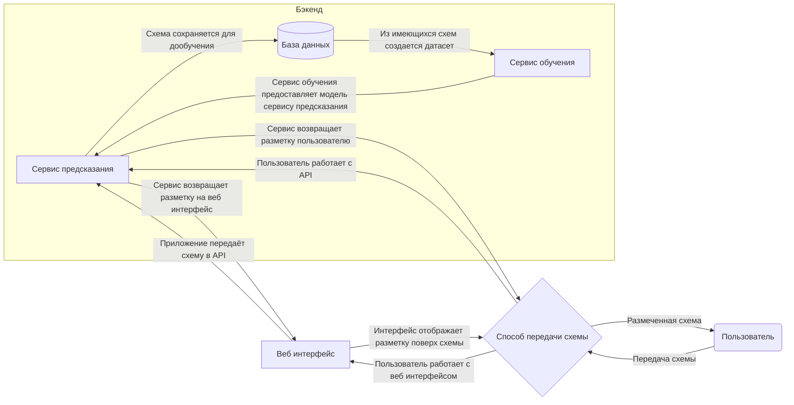

---
# You can also start simply with 'default'
theme: apple-basic
# https://sli.dev/features/drawing
drawings:
  persist: false
# slide transition: https://sli.dev/guide/animations.html#slide-transitions
transition: slide-left
# enable MDC Syntax: https://sli.dev/features/mdc
mdc: true
layout: cover
---

<div style="display:flex; flex-direction: column; top: 0; left: 0; position: absolute; width: 100%; height: 100%;">
  <div style="justify-self: center; align-self: center; display: flex; flex-direction: column; margin-top: 1rem; text-align: center">
    <span>МИНОБРНАУКИ РОССИИ ФГБОУ ВО “ТвГТУ”</span>
    <span>Факультет информационных технологий</span>
    <span>Кафедра программного обеспечения</span>
    <span>Направление подготовки бакалавров 09.03.04 Программная инженерия</span>
  </div>
  <div style="display: flex; flex-direction: column; align-self: center; justify-self: center; margin-top: auto; margin-bottom: auto; text-align: center">
    <span style="font-size: 1rem">Выпускная квалификационная работа на тему</span>
    <span style="font-size: 1.5rem">Разработка ПО для сериализации низкоинформативных графических </span>
    <span style="font-size: 1.5rem">данных на основе клиент-серверной технологии</span>
  </div>
  <div style="display: flex; flex-direction: column; align-self: flex-start; margin-left: 1rem; justify-self: right; margin-top: auto; margin-bottom: auto; text-align: left">
    <span>Подготовил: студент 4 курса группы Б.ПИН.РИС.2106 Миронов Максим Валерьевич</span>
    <span>Руководитель: профессор кафедры ПО Калабин Александр Леонидович</span>
  </div>
  <div style="margin-bottom: 1rem; text-align: center">
    2025
  </div>
</div>

---
layout: center
---

<QrCodeComponent style="align-self: center; justify-self: center" :dark-mode="useDarkMode().isDark.value"/>

page: https://dip-slides.vercel.app/

source: https://github.com/NydusBorn/dip-slides
<script setup lang="ts">
import { useDarkMode } from '@slidev/client';
</script>
---

# Проблемная область и цели проекта

- Электрические схемы состоят из большого количества элементов, которые не всегда имеют одинаковую структуру.
- Время обработки схемы человеком составляет от часа.
- Требуется определить количество элементов на схеме, и их артикулы, например для выставления счета заказчику.

На основе этого мы имеем следующие цели:
- Разработать алгоритм принимающий схемы, и выдающий целевые параметры схемы (например артикулы на схеме).
- Предложить API для работы с системой.
- Предложить референсный интерфейс для API.


---

# Актуальность


|                        | Этот распознаватель                | Konergy                             | Человек                   |
|------------------------|------------------------------------|-------------------------------------|---------------------------|
| Время работы           | < 15 секунд*                       | > 30 секунд                         | > 1 час                   |
| Цена                   | Бесплатно                          | 100 р схема**                       | Обсуждается с сотрудником |
| Возможность интеграции | Легко встраивается в любые системы | Обсуждается с разработчиком         | -                         |
| Дообучение             | Встроено в систему на всех уровнях | Только для корпоративных заказчиков | -                         |
| Качество               | 70%***                             | 80%                                 | 95+%                      |

*Требуется GPU от Nvidia не ниже RTX 4060<br>
**На других планах цены могут быть ниже<br>
***Можно дообучить для ваших схем

Таким образом этот продукт может быть интересен когда требуется широкая кастомизация или есть финансовые ограничения.

<style>
table{
  font-size: 0.75rem
}
p{
  font-size: 0.75rem
}
</style>

<script setup lang="ts">
import { useDarkMode } from '@slidev/client'
</script>

---

# Сравнение результата

Слева распознаватель*, справа Konergy

<div style="display: flex; flex-direction: row; gap: 1rem">


</div>


<br>
<br>
*Результаты не отражают финальное состояние продукта

<style>
img{
  width: 400px
}
</style>

<script setup lang="ts">
import { useDarkMode } from '@slidev/client'
</script>

---

# Предполагаемые сценарии

- Развертка системы локально у пользователя в полном объеме (с возможностью подключиться к внешним источникам для тех или иных задач).
  - Разного рода задачи связанные с разработкой, например создание и тестирование моделей распознавания изображений (для любых задач).
- Развертка системы внутри закрытой сети без доступа к внешним ресурсам.
  - Предоставление и разработка моделей для распознаний электро схем (или других схем аналогичных по принципу)
  - Предоставление сервиса для обработки изображений (может потребоваться доработка для конкретной задачи).

---

# Ключевые функции

- Распознавание изображений.
  - С использованием растровых форматов (PNG, WEBP, JPG), а также векторных форматов (PDF)
  - Возможность использовать модель оптимизированную под тот или иной внешний вид входных данных.
  - Выгрузка полученных целевых метрик.
- Сохранение и обработка результатов распознавания.
- Упрощенное обучение моделей.
  - Упрощенное добавление данных для обучения (например посредством предразметки).
  - Отсутствие нужды подбирать параметры.
- Автоматизированная развертка
  - Возможность быстро развернуть сервис с одной машины (например для разработчика).
  - Возможность развернуть систему в распределенном виде.

---

# Технологический Стек 

ОС Windows и *nix.

Микро сервисная архитектура на основе Python+Fastapi (Выбран благодаря легкости работы с машинным обучением) и 
Vue+Nuxt (Nuxt реализует практически все возможные способы работы с фронтендами, а также имеет встроенный бэкенд сервер).

Label Studio (Одно из лучших средств разметки данных, может быть развернуто локально) и Postgres (Популярная СУБД) в качестве поддерживающих модулей.

Также для упрощенной развертки используется Docker и Docker-Compose.

Для разработки ПО также используются IDE от Jetbrains, в частности:
- Pycharm - для разработки бэкенда
- Webstorm - для разработки фронтенда
- Datagrip - для работы с базами данных
- Intellij IDEA - для разработки документации (при помощи плагина Writerside)


---

# Решенные задачи

Для достижения указанных целей и ранее представленных результатов были поставлены следующие задачи:
- Создание датасета:
  - Как и что размечать?
  - Как компенсировать недостаток данных?
- Обучение модели:
  - На чём обучать модель?
  - Какие параметры обучения модели оптимальны для нашей задачи?
- Распознавание:
  - Оптимальное задействование ресурсов ПК.
  - Организация информации для пользователя.

---

# Архитектурные решения
<br>

В процессе решения ранее указанных задач приложение было построено в набор сервисов, реализующий принципы REST API.

Клиент подключается либо через API, либо через веб интерфейс, который реализует функционал посредством коммуникации с тем же самым API.

Общение между сервисами организовано через протокол HTTP, основным форматом данных являются JSON объекты.

---

# Схема приложения



---

# Разработка датасета

Датасет в данном случае состоит из изображений электронных схем.


---

# Аугментация изображений

Для увеличения объема данных и увеличения их разнообразия производится аугментация:

- Из изображения вырезается некоторый кусок.
- Количество УГО и УТО уравнивается, посредством удаления с изображений более многочисленного класса.


---

# Обучение модели

Помимо обучающей выборки на этом этапе в датасет добавляются фоны, позволяющие уменьшить количество ложных распознаваний.

Пример фонов:

<div style="position: absolute; left: 470px; top: 125px; margin-right: 20px">
Код обучения:
```python
result = model.train(
       data=os.path.join(settings.DATASET_DIR, "dataset.yaml"), 
       imgsz=1024, name=name_dt,
       optimizer="AdamW", cache=True, time=0.25, batch=4,
       multi_scale=True, deterministic=False, cos_lr=True,
       lr0=0.001, lrf=0.00001, close_mosaic=5, exist_ok=True,
       flipud=0.5, fliplr=0.5, hsv_s=0.5, hsv_h=0.5, hsv_v=0.5,
       bgr=0.5, degrees=1, shear=1, perspective=0.00001,
       copy_paste=0.0, mixup=0.0)
```

На основе приведенных параметров достигается более высокая скорость обучения, и более высокое качество моделей, так как 
большая часть процесса аугментации происходит в реальном времени в процессе обучения.
</div>

--- 

# Распознавание изображения

После передачи схемы и её обработки данные выводятся пользователю следующим образом:


---

# Тестирование модели

Результат в значительной мере зависит от соответствия входного изображения датасету:

<div style="display: flex; flex-direction: row; justify-content: space-between">

<div>
Входная схема не соответствует датасету:

Распознано: 64% УГО.
</div>
<div>
Входная схема соответствует датасету:

Распознано: 100% УГО.
</div>

</div>

---

# Выходные данные

После обработки схемы можно получить 2 документа: DOCX и XLSX. 

<div style="display: flex; flex-direction: row; justify-content: space-between">

<div>

В данном документе предоставляются все найденные на схеме артикулы.
</div>
<div>

В данном документе предоставляются все распознанные объекты на схеме.
</div>

</div>


---

# Демонстрация функционала

<SlidevVideo controls style="height: 400px; justify-self: center; align-self: center">
  <source :src="useDarkMode().isDark.value ? `/demo_dark.mp4` : `/demo_light.mp4`" type="video/mp4"/>
</SlidevVideo>

<script setup lang="ts">
import { useDarkMode } from '@slidev/client'
</script>

---

# Заключение

Проект реализует решения для проблемы скорости обработки, тем самым позволяя оператору начинать не с "нуля" а с предварительного вывода, 
с указателями где что было найдено, и по каким критериям сформировано.

В пределах проекта были решены задачи оптимального обучения моделей YOLO в контексте электрических схем, их корректного применения, 
а также организована система дообучения системы на основе входных данных.

---
layout: fact
---

# Спасибо за внимание!