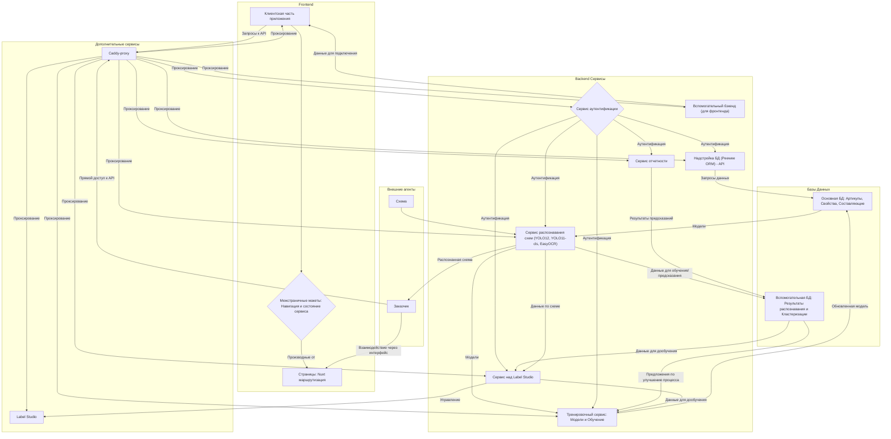
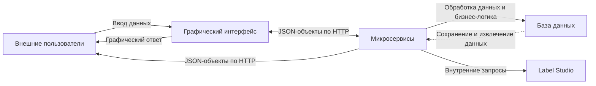
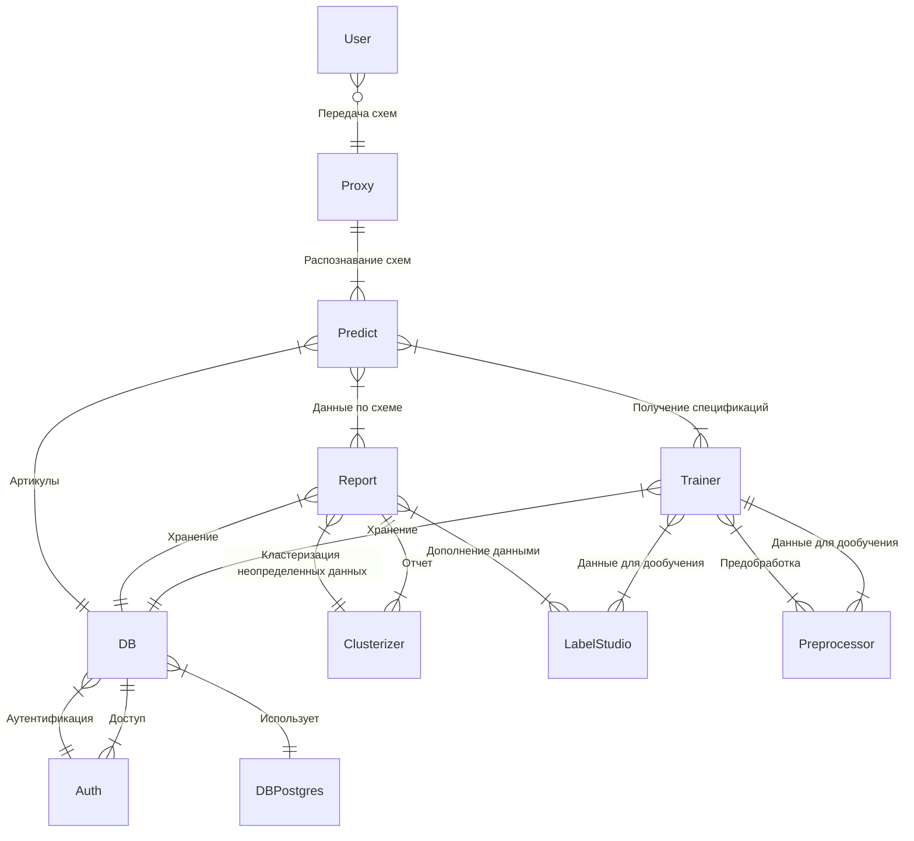
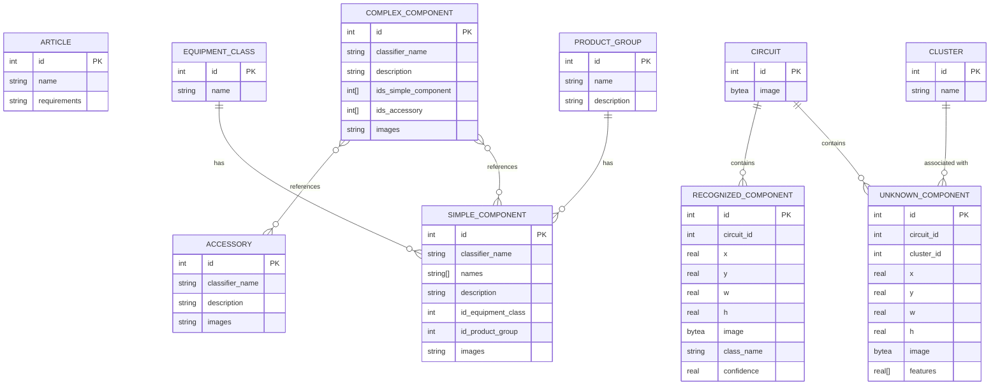

---
# You can also start simply with 'default'
theme: apple-basic
# https://sli.dev/features/drawing
drawings:
  persist: false
# slide transition: https://sli.dev/guide/animations.html#slide-transitions
transition: slide-left
# enable MDC Syntax: https://sli.dev/features/mdc
mdc: true
layout: cover
---

<div style="display:flex; flex-direction: column; top: 0; left: 0; position: absolute; width: 100%; height: 100%;">
  <div style="justify-self: center; align-self: center; display: flex; flex-direction: column; margin-top: 1rem; text-align: center">
    <span>МИНОБРНАУКИ РОССИИ ФГБОУ ВО “ТвГТУ”</span>
    <span>Факультет информационных технологий</span>
    <span>Кафедра программного обеспечения</span>
    <span>Направление подготовки бакалавров 09.03.04 Программная инженерия</span>
  </div>
  <div style="display: flex; flex-direction: column; align-self: center; justify-self: center; margin-top: auto; margin-bottom: auto; text-align: center">
    <span style="font-size: 1rem">Выпускная квалификационная работа на тему</span>
    <span style="font-size: 1.5rem">Разработка ПО для сериализации низкоинформативных графических </span>
    <span style="font-size: 1.5rem">данных на основе клиент-серверной технологии</span>
  </div>
  <div style="display: flex; flex-direction: column; align-self: flex-start; margin-left: 1rem; justify-self: right; margin-top: auto; margin-bottom: auto; text-align: left">
    <span>Подготовил: студент 4 курса группы Б.ПИН.РИС.2106 Миронов Максим Валерьевич</span>
    <span>Научный Руководитель: профессор кафедры ПО Калабин Александр Леонидович</span>
  </div>
  <div style="margin-bottom: 1rem; text-align: center">
    2025
  </div>
</div>

---
layout: center
---

<QrCodeComponent style="align-self: center; justify-self: center" :dark-mode="useDarkMode().isDark.value"/>

page: https://dip-slides.vercel.app/

source: https://github.com/NydusBorn/dip-slides
<script setup lang="ts">
import { useDarkMode } from '@slidev/client';
</script>
---

# Проблемная область и цели проекта

- Электрические схемы состоят из большого количества элементов, которые не всегда имеют одинаковую структуру.
- Время обработки схемы человеком составляет ~3 дня.
- Требуется определить количество элементов на схеме, и их артикулы, например для выставления счета заказчику.

На основе этого мы имеем следующие цели:
- Разработать алгоритм принимающий схемы, и выдающий целевые параметры схемы (например артикулы на схеме).
- Предложить API для работы с системой.
- Предложить референсный интерфейс для API.


---

# Актуальность


|                        | Этот распознаватель                | Konergy                             | Человек                   |
|------------------------|------------------------------------|-------------------------------------|---------------------------|
| Время работы           | < 15 секунд*                       | > 30 секунд                         | > 1 час                   |
| Цена                   | Бесплатно                          | 100 р схема**                       | Обсуждается с сотрудником |
| Возможность интеграции | Легко встраивается в любые системы | Обсуждается с разработчиком         | -                         |
| Дообучение             | Встроено в систему на всех уровнях | Только для корпоративных заказчиков | -                         |
| Качество               | 70%***                             | 80%                                 | 95+%                      |

*Требуется GPU от Nvidia не ниже RTX 4060<br>
**На других планах цены могут быть ниже<br>
***Можно дообучить для ваших схем

Таким образом этот продукт может быть интересен когда требуется широкая кастомизация или есть финансовые ограничения.

<style>
table{
  font-size: 0.75rem
}
p{
  font-size: 0.75rem
}
</style>

<script setup lang="ts">
import { useDarkMode } from '@slidev/client'
</script>

---

# Сравнение результата

Слева распознаватель*, справа Konergy

<div style="display: flex; flex-direction: row; gap: 1rem">


</div>


<br>
<br>
*Результаты не отражают финальное состояние продукта

<style>
img{
  width: 400px
}
</style>

<script setup lang="ts">
import { useDarkMode } from '@slidev/client'
</script>

---

# Предполагаемые сценарии

- Развертка системы локально у пользователя в полном объеме (с возможностью подключиться к внешним источникам для тех или иных задач).
  - Разного рода задачи связанные с разработкой, например создание и тестирование моделей распознавания изображений (для любых задач).
- Развертка системы внутри закрытой сети без доступа к внешним ресурсам.
  - Предоставление и разработка моделей для распознаний электро схем (или других схем аналогичных по принципу)
  - Предоставление сервиса для обработки изображений (может потребоваться доработка для конкретной задачи).

---

# Ключевые функции

- Распознавание изображений.
  - В том числе и в векторном формате (PDF)
  - Возможность использовать модель оптимизированную под тот или иной внешний вид входных данных.
  - Выгрузка полученных целевых метрик.
- Сохранение и обработка результатов распознавания.
- Упрощенное обучение моделей.
  - Упрощенное добавление данных для обучения (например посредством предразметки).
  - Отсутствие нужды подбирать параметры.
- Автоматизированная развертка
  - Возможность быстро развернуть сервис с одной машины (например для разработчика).
  - Возможность развернуть систему в распределенном виде.

---

# Технологический Стек 

ОС Windows и *nix.

Микро сервисная архитектура на основе Python+Fastapi (Выбран благодаря легкости работы с машинным обучением) и 
Vue+Nuxt (Nuxt реализует практически все возможные способы работы с фронтендами, а также имеет встроенный бэкенд сервер).

Label Studio (Одно из лучших средств разметки данных, может быть развернуто локально) и Postgres (Популярная СУБД) в качестве поддерживающих модулей.

Также для упрощенной развертки используется Docker и Docker-Compose.


---

# Архитектурные решения
<br>
Приложение основано на клиент-серверных отношениях, где сервер представляет собой набор микросервисов.

- Клиент обращается к разным сервисам для выполнения своих задач.
- Микросервисы также обращаются друг к другу когда им требуется сделать что либо выходящие за их рамки.
---

# Функциональная схема



---

# Архитектура приложения



---

# Структурная схема


---

# Структура БД



---

# Распознавание изображения

Основная единица распознавания — bbox:
```python
class bbox:
    def __init__(self, id:int, cls:int, conf:float, x:float, y:float, w:float, h:float, name:str):
        self.id: int = id
        self.cls: int = cls
        self.conf: float = conf
        self.x: float = x
        self.y: float = y
        self.w: float = w
        self.h: float = h
        self.name: str = name
        self.sub_image: np.ndarray = None
        self.text: str = "error"
        self.connections: list[bbox] = []
        self.article: Optional[dict] = None
```

На основе этого класса происходит коммуникация между клиентом и сервером. 

---

# Упрощенное обучение

Для внешних потребителей — обучение состоит из 2 комманд в консоли.

Пример бэкраундов:

<div style="position: absolute; left: 470px; top: 125px">
Код обучения:
```python
result = model.train(
       data=os.path.join(settings.DATASET_DIR, "dataset.yaml"), 
       imgsz=1024, name=name_dt,
       optimizer="AdamW", cache=True, time=0.25, batch=4,
       multi_scale=False, deterministic=False, cos_lr=True,
       lr0=0.001, lrf=0.00001, close_mosaic=5, exist_ok=True,
       flipud=0.5, fliplr=0.5, hsv_s=0.5, hsv_h=0.5, hsv_v=0.5,
       bgr=0.5, degrees=1, shear=1, perspective=0.00001,
       copy_paste=0.0, mixup=0.0)
```
</div>
---

# Автоматизированная развертка

Пример локальной развертки монолита:
```yaml {*}{class:'!children:text-0.5rem !children:leading-0.15rem'}
  mono:
    profiles:
      - full
      - mono
    container_name: rvs-mono
    restart: unless-stopped
    build: ./Program
    networks:
      - rvsnet
    volumes:
      - ./Program/settings-docker.py:/app/settings.py:Z
      - ./Program/fonts:/app/fonts:Z
      - ./Program/runs_obb:/app/runs_obb:Z
      - ./Program/runs_ocr:/app/runs_ocr:Z
    ports:
      - "8000:8000"
      - "8001:8001"
      - "8002:8002"
      - "8003:8003"
      - "8004:8004"
      - "8005:8005"
      - "8006:8006"
    deploy:
      resources:
        reservations:
          devices:
            - driver: nvidia
              count: all
              capabilities:
                - gpu
```
---

# GUI

Интерфейс для сложной графики использует по кадровое обновление

```ts {*}{class:'!children:text-0.5rem !children:leading-0.15rem'}
useInterval(1000 / 60, {
  callback: () => {
    let elem = document.getElementById("img_element");
    if (elem != null) {
      img_elem.value = elem.getBoundingClientRect();
    }
    if (current_viewer.value != null) {
      current_image_data.value = current_viewer.value.imageData;
      if (!current_viewer.value.ready) {
        current_viewer.value = null;
      }
    }
    computed_viewer.value = {
      transform: (() => {
        if (current_viewer.value != null) {
          return `scale(${current_image_data.value?.ratio})`;
        } else return `scale(${img_elem_factor.value ?? 1})`;
      })(),
      left: (() => {
        if (current_viewer.value != null) {
          return `${current_image_data.value?.left}px`;
        } else return "";
      })(),
      top: (() => {
        if (current_viewer.value != null) {
          return `${current_image_data.value?.top}px`;
        } else return "";
      })(),
    };
  },
});
```
---

# Тестирование
<br>
Тестирование введено только на этапе обучения модели, и состоит из проверки изображения на валидационных схемах, с получаемыми метриками, 
и на тестовых схемах, для которых используется визуальный осмотр.


---

# Демонстрация функционала

<SlidevVideo controls style="height: 400px; justify-self: center; align-self: center">
  <source :src="useDarkMode().isDark.value ? `/demo_dark.mp4` : `/demo_light.mp4`" type="video/mp4"/>
</SlidevVideo>

<script setup lang="ts">
import { useDarkMode } from '@slidev/client'
</script>

---

# Заключение

Проект реализует решения для проблемы скорости обработки, тем самым позволяя оператору начинать не с "нуля" а с предварительного вывода, 
с указателями где что было найдено, и по каким критериям сформировано.

В пределах проекта были решены задачи оптимального обучения моделей YOLO в контексте электрических схем, их корректного применения, 
а также организована система дообучения системы на основе входных данных.

---
layout: fact
---

# Спасибо за внимание!