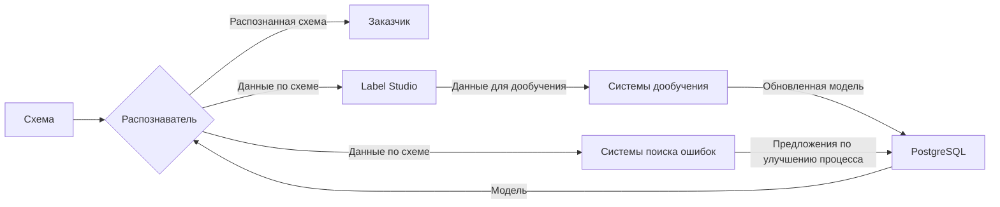
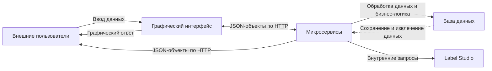
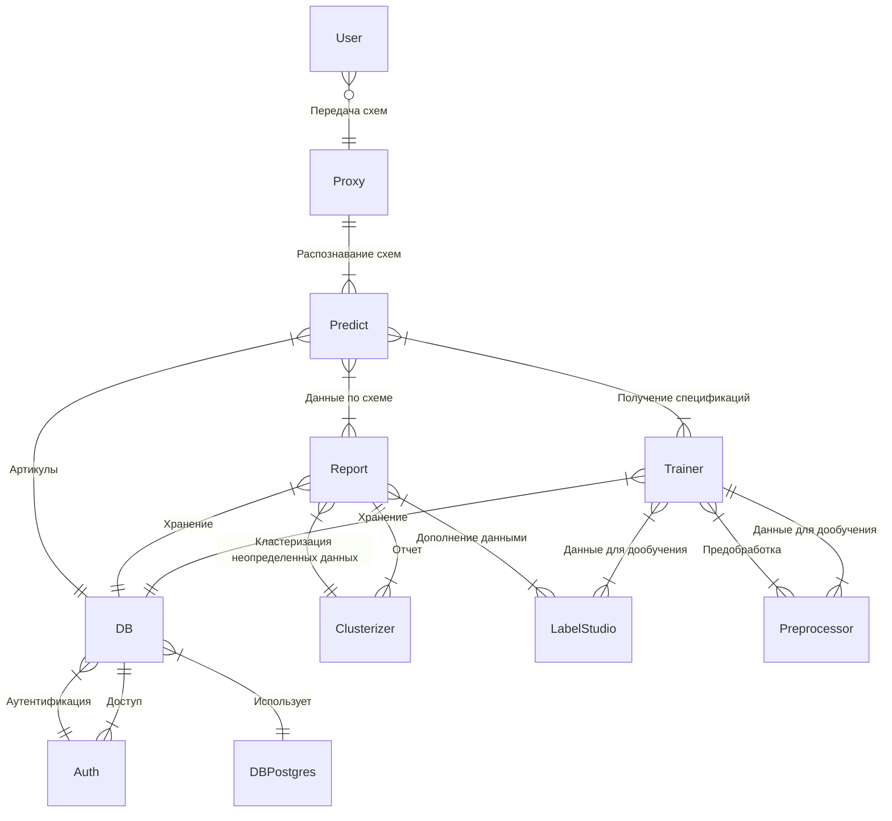

---
# You can also start simply with 'default'
theme: apple-basic
# https://sli.dev/features/drawing
drawings:
  persist: false
# slide transition: https://sli.dev/guide/animations.html#slide-transitions
transition: slide-left
# enable MDC Syntax: https://sli.dev/features/mdc
mdc: true
layout: cover
---

<div style="display:flex; flex-direction: column; top: 0; left: 0; position: absolute; width: 100%; height: 100%;">
  <div style="justify-self: center; align-self: center; display: flex; flex-direction: column; margin-top: 1rem; text-align: center">
    <span>МИНОБРНАУКИ РОССИИ ФГБОУ ВО “ТвГТУ”</span>
    <span>Факультет информационных технологий</span>
    <span>Кафедра программного обеспечения</span>
    <span>Направление подготовки бакалавров 09.03.04 Программная инженерия</span>
  </div>
  <div style="display: flex; flex-direction: column; align-self: center; justify-self: center; margin-top: auto; margin-bottom: auto; text-align: center">
    <span style="font-size: 1rem">Выпускная квалификационная работа на тему</span>
    <span style="font-size: 1.5rem">Разработка ПО для сериализации низкоинформативных графических </span>
    <span style="font-size: 1.5rem">данных на основе клиент-серверной технологии</span>
  </div>
  <div style="display: flex; flex-direction: column; align-self: flex-start; margin-left: 1rem; justify-self: right; margin-top: auto; margin-bottom: auto; text-align: left">
    <span>Подготовил: студент 4 курса группы Б.ПИН.РИС.2106 Миронов Максим Валерьевич</span>
    <span>Научный Руководитель: профессор кафедры ПО Калабин Александр Леонидович</span>
  </div>
  <div style="margin-bottom: 1rem; text-align: center">
    2025
  </div>
</div>

---
layout: center
---

<QrCodeComponent style="align-self: center; justify-self: center" :dark-mode="useDarkMode().isDark.value"/>

page: https://dip-slides.vercel.app/

source: https://github.com/NydusBorn/dip-slides
<script setup lang="ts">
import { useDarkMode } from '@slidev/client';
</script>
---

# Проблемная область и цели проекта

- Электрические схемы состоят из большого количества элементов, которые не всегда имеют одинаковую структуру.
- Время обработки схемы человеком составляет ~3 дня.
- Требуется определить количество элементов на схеме, и их артикулы, например для выставления счета заказчику.

На основе этого мы имеем следующие цели:
- Разработать алгоритм принимающий схемы, и выдающий целевые параметры схемы (например артикулы на схеме).
- Предложить API для работы с системой.
- Предложить референсный интерфейс для API.


---

# Актуальность


|                        | Этот распознаватель                | Konergy                             | Человек                   |
|------------------------|------------------------------------|-------------------------------------|---------------------------|
| Время работы           | < 15 секунд*                       | > 30 секунд                         | > 1 час                   |
| Цена                   | Бесплатно                          | 100 р схема**                       | Обсуждается с сотрудником |
| Возможность интеграции | Легко встраивается в любые системы | Обсуждается с разработчиком         | -                         |
| Дообучение             | Встроено в систему на всех уровнях | Только для корпоративных заказчиков | -                         |
| Качество               | 70%***                             | 80%                                 | 95+%                      |

*Требуется GPU от Nvidia не ниже RTX 4060<br>
**На других планах цены могут быть ниже<br>
***Можно дообучить для ваших схем

Таким образом этот продукт может быть интересен когда требуется широкая кастомизация или есть финансовые ограничения.

<style>
table{
  font-size: 0.75rem
}
p{
  font-size: 0.75rem
}
</style>

<script setup lang="ts">
import { useDarkMode } from '@slidev/client'
</script>

---

# Сравнение результата

Слева распознаватель*, справа Konergy

<div style="display: flex; flex-direction: row; gap: 1rem">


</div>


<br>
<br>
*Результаты не отражают финальное состояние продукта

<style>
img{
  width: 400px
}
</style>

<script setup lang="ts">
import { useDarkMode } from '@slidev/client'
</script>

---

# Предполагаемые сценарии

- Развертка системы локально у пользователя в полном объеме (с возможностью подключиться к внешним источникам для тех или иных задач).
  - Разного рода задачи связанные с разработкой, например создание и тестирование моделей распознавания изображений (для любых задач).
- Развертка системы внутри закрытой сети без доступа к внешним ресурсам.
  - Предоставление и разработка моделей для распознаний электро схем (или других схем аналогичных по принципу)
  - Предоставление сервиса для обработки изображений (может потребоваться доработка для конкретной задачи).

---

# Ключевые функции

- Распознавание изображений.
  - В том числе и в векторном формате (PDF)
  - Возможность использовать модель оптимизированную под тот или иной внешний вид входных данных.
  - Выгрузка полученных целевых метрик.
- Сохранение и обработка результатов распознавания.
- Упрощенное обучение моделей.
  - Упрощенное добавление данных для обучения (например посредством предразметки).
  - Отсутствие нужды подбирать параметры.
- Автоматизированная развертка
  - Возможность быстро развернуть сервис с одной машины (например для разработчика).
  - Возможность развернуть систему в распределенном виде.

---

# Технологический Стек 

ОС Windows и *nix.

Микро сервисная архитектура на основе Python+Fastapi (Выбран благодаря легкости работы с машинным обучением) и 
Vue+Nuxt (Nuxt реализует практически все возможные способы работы с фронтендами, а также имеет встроенный бэкенд сервер).

Label Studio (Одно из лучших средств разметки данных, может быть развернуто локально) и Postgres (Популярная СУБД) в качестве поддерживающих модулей.

Docker (Упрощает развертывание приложения) для локальной развертки и 
Kubernetes (Позволяет развернуть приложение в кластере, предоставляет сервисы улучшающие работу приложения при 
развертке на облаках, гибридных системах, и флотах серверов) для системной развертки. 
Также для упрощения работы с Kubernetes используется OpenTofu (позволяет развернуть систему не разбираясь в локальном кластере).


---

# Архитектурные решения
<br>
Приложение основано на клиент-серверных отношениях, где сервер представляет собой набор микросервисов.

- Клиент обращается к разным сервисам для выполнения своих задач.
- Микросервисы также обращаются друг к другу когда им требуется сделать что либо выходящие за их рамки.
---

# Функциональная схема



---

# Архитектура приложения



---

# Структурная схема


---

# Структура БД


---

# Распознавание изображения

Основная единица распознавания — bbox:
```python
class bbox:
    def __init__(self, id:int, cls:int, conf:float, x:float, y:float, w:float, h:float, name:str):
        self.id: int = id
        self.cls: int = cls
        self.conf: float = conf
        self.x: float = x
        self.y: float = y
        self.w: float = w
        self.h: float = h
        self.name: str = name
        self.sub_image: np.ndarray = None
        self.text: str = "error"
        self.connections: list[bbox] = []
        self.article: Optional[dict] = None
```

На основе этого класса происходит коммуникация между клиентом и сервером. 

---

# Упрощенное обучение

Для внешних потребителей — обучение состоит из 2 комманд в консоли.

Пример бэкраундов:

<div style="position: absolute; left: 470px; top: 125px">
Код обучения:
```python
result = model.train(
       data=os.path.join(settings.DATASET_DIR, "dataset.yaml"), 
       imgsz=1024, name=name_dt,
       optimizer="AdamW", cache=True, time=0.25, batch=4,
       multi_scale=False, deterministic=False, cos_lr=True,
       lr0=0.001, lrf=0.00001, close_mosaic=5, exist_ok=True,
       flipud=0.5, fliplr=0.5, hsv_s=0.5, hsv_h=0.5, hsv_v=0.5,
       bgr=0.5, degrees=1, shear=1, perspective=0.00001,
       copy_paste=0.0, mixup=0.0)
```
</div>
---

# Автоматизированная развертка

Пример локальной развертки монолита:
```yaml {*}{class:'!children:text-0.5rem !children:leading-0.15rem'}
  mono:
    profiles:
      - full
      - mono
    container_name: rvs-mono
    restart: unless-stopped
    build: ./Program
    networks:
      - rvsnet
    volumes:
      - ./Program/settings-docker.py:/app/settings.py:Z
      - ./Program/fonts:/app/fonts:Z
      - ./Program/runs_obb:/app/runs_obb:Z
      - ./Program/runs_ocr:/app/runs_ocr:Z
    ports:
      - "8000:8000"
      - "8001:8001"
      - "8002:8002"
      - "8003:8003"
      - "8004:8004"
      - "8005:8005"
      - "8006:8006"
    deploy:
      resources:
        reservations:
          devices:
            - driver: nvidia
              count: all
              capabilities:
                - gpu
```
---

# GUI

Интерфейс для сложной графики использует по кадровое обновление

```ts {*}{class:'!children:text-0.5rem !children:leading-0.15rem'}
useInterval(1000 / 60, {
  callback: () => {
    let elem = document.getElementById("img_element");
    if (elem != null) {
      img_elem.value = elem.getBoundingClientRect();
    }
    if (current_viewer.value != null) {
      current_image_data.value = current_viewer.value.imageData;
      if (!current_viewer.value.ready) {
        current_viewer.value = null;
      }
    }
    computed_viewer.value = {
      transform: (() => {
        if (current_viewer.value != null) {
          return `scale(${current_image_data.value?.ratio})`;
        } else return `scale(${img_elem_factor.value ?? 1})`;
      })(),
      left: (() => {
        if (current_viewer.value != null) {
          return `${current_image_data.value?.left}px`;
        } else return "";
      })(),
      top: (() => {
        if (current_viewer.value != null) {
          return `${current_image_data.value?.top}px`;
        } else return "";
      })(),
    };
  },
});
```
---

# Тестирование
<br>
Тестирование введено только на этапе обучения модели, и состоит из проверки изображения на валидационных схемах, с получаемыми метриками, 
и на тестовых схемах, для которых используется визуальный осмотр.


---

# Демонстрация функционала

<SlidevVideo controls style="height: 400px; justify-self: center; align-self: center">
  <source :src="useDarkMode().isDark.value ? `/demo_dark.mp4` : `/demo_light.mp4`" type="video/mp4"/>
</SlidevVideo>

<script setup lang="ts">
import { useDarkMode } from '@slidev/client'
</script>

---

# Заключение

Проект реализует решения для проблемы скорости обработки, тем самым позволяя оператору начинать не с "нуля" а с предварительного вывода, 
с указателями где что было найдено, и по каким критериям сформировано.

Основная часть работы готова, осталось улучшить внешний вид интерфейса, отловить баги, провести ревизию кода.

---
layout: fact
---

# Спасибо за внимание!

[//]: # (---)

[//]: # ()
[//]: # (# What is Slidev?)

[//]: # ()
[//]: # (Slidev is a slides maker and presenter designed for developers, consist of the following features)

[//]: # ()
[//]: # (- 📝 **Text-based** - focus on the content with Markdown, and then style them later)

[//]: # (- 🎨 **Themable** - themes can be shared and re-used as npm packages)

[//]: # (- 🧑💻 **Developer Friendly** - code highlighting, live coding with autocompletion)

[//]: # (- 🤹 **Interactive** - embed Vue components to enhance your expressions)

[//]: # (- 🎥 **Recording** - built-in recording and camera view)

[//]: # (- 📤 **Portable** - export to PDF, PPTX, PNGs, or even a hostable SPA)

[//]: # (- 🛠 **Hackable** - virtually anything that's possible on a webpage is possible in Slidev)

[//]: # (<br>)

[//]: # (<br>)

[//]: # ()
[//]: # (Read more about [Why Slidev?]&#40;https://sli.dev/guide/why&#41;)

[//]: # ()
[//]: # (<!--)

[//]: # (You can have `style` tag in markdown to override the style for the current page.)

[//]: # (Learn more: https://sli.dev/features/slide-scope-style)

[//]: # (-->)

[//]: # ()
[//]: # (<style>)

[//]: # (h1 {)

[//]: # (  background-color: #2B90B6;)

[//]: # (  background-image: linear-gradient&#40;45deg, #4EC5D4 10%, #146b8c 20%&#41;;)

[//]: # (  background-size: 100%;)

[//]: # (  -webkit-background-clip: text;)

[//]: # (  -moz-background-clip: text;)

[//]: # (  -webkit-text-fill-color: transparent;)

[//]: # (  -moz-text-fill-color: transparent;)

[//]: # (})

[//]: # (</style>)

[//]: # ()
[//]: # (<!--)

[//]: # (Here is another comment.)

[//]: # (-->)

[//]: # ()
[//]: # (---)

[//]: # (transition: slide-up)

[//]: # (level: 2)

[//]: # (---)

[//]: # ()
[//]: # (# Navigation)

[//]: # ()
[//]: # (Hover on the bottom-left corner to see the navigation's controls panel, [learn more]&#40;https://sli.dev/guide/ui#navigation-bar&#41;)

[//]: # ()
[//]: # (## Keyboard Shortcuts)

[//]: # ()
[//]: # (|                                                     |                             |)

[//]: # (| --------------------------------------------------- | --------------------------- |)

[//]: # (| <kbd>right</kbd> / <kbd>space</kbd>                 | next animation or slide     |)

[//]: # (| <kbd>left</kbd>  / <kbd>shift</kbd><kbd>space</kbd> | previous animation or slide |)

[//]: # (| <kbd>up</kbd>                                       | previous slide              |)

[//]: # (| <kbd>down</kbd>                                     | next slide                  |)

[//]: # ()
[//]: # (<!-- https://sli.dev/guide/animations.html#click-animation -->)

[//]: # ()

[//]: # (<p v-after class="absolute bottom-23 left-45 opacity-30 transform -rotate-10">Here!</p>)

[//]: # ()
[//]: # (---)

[//]: # (layout: two-cols)

[//]: # (layoutClass: gap-16)

[//]: # (---)

[//]: # ()
[//]: # (# Table of contents)

[//]: # ()
[//]: # (You can use the `Toc` component to generate a table of contents for your slides:)

[//]: # ()
[//]: # (```html)

[//]: # (<Toc minDepth="1" maxDepth="1" />)

[//]: # (```)

[//]: # ()
[//]: # (The title will be inferred from your slide content, or you can override it with `title` and `level` in your frontmatter.)

[//]: # ()
[//]: # (::right::)

[//]: # ()
[//]: # (<Toc text-sm minDepth="1" maxDepth="2" />)

[//]: # ()
[//]: # (---)

[//]: # (layout: image-right)

[//]: # (image: https://cover.sli.dev)

[//]: # (---)

[//]: # ()
[//]: # (# Code)

[//]: # ()
[//]: # (Use code snippets and get the highlighting directly, and even types hover!)

[//]: # ()
[//]: # (```ts {all|5|7|7-8|10|all} twoslash)

[//]: # (// TwoSlash enables TypeScript hover information)

[//]: # (// and errors in markdown code blocks)

[//]: # (// More at https://shiki.style/packages/twoslash)

[//]: # ()
[//]: # (import { computed, ref } from 'vue')

[//]: # ()
[//]: # (const count = ref&#40;0&#41;)

[//]: # (const doubled = computed&#40;&#40;&#41; => count.value * 2&#41;)

[//]: # ()
[//]: # (doubled.value = 2)

[//]: # (```)

[//]: # ()
[//]: # ()
[//]: # (<!-- This allow you to embed external code blocks -->)

[//]: # ()
[//]: # (<!-- Footer -->)

[//]: # ()
[//]: # ([Learn more]&#40;https://sli.dev/features/line-highlighting&#41;)

[//]: # ()
[//]: # (<!-- Inline style -->)

[//]: # (<style>)

[//]: # (.footnotes-sep {)

[//]: # (  @apply mt-5 opacity-10;)

[//]: # (})

[//]: # (.footnotes {)

[//]: # (  @apply text-sm opacity-75;)

[//]: # (})

[//]: # (.footnote-backref {)

[//]: # (  display: none;)

[//]: # (})

[//]: # (</style>)

[//]: # ()
[//]: # (<!--)

[//]: # (Notes can also sync with clicks)

[//]: # ()
[//]: # ([click] This will be highlighted after the first click)

[//]: # ()
[//]: # ([click] Highlighted with `count = ref&#40;0&#41;`)

[//]: # ()
[//]: # ([click:3] Last click &#40;skip two clicks&#41;)

[//]: # (-->)

[//]: # ()
[//]: # (---)

[//]: # (level: 2)

[//]: # (---)

[//]: # ()
[//]: # (# Shiki Magic Move)

[//]: # ()
[//]: # (Powered by [shiki-magic-move]&#40;https://shiki-magic-move.netlify.app/&#41;, Slidev supports animations across multiple code snippets.)

[//]: # ()
[//]: # (Add multiple code blocks and wrap them with <code>````md magic-move</code> &#40;four backticks&#41; to enable the magic move. For example:)

[//]: # ()
[//]: # (````md magic-move {lines: true})

[//]: # (```ts {*|2|*})

[//]: # (// step 1)

[//]: # (const author = reactive&#40;{)

[//]: # (  name: 'John Doe',)

[//]: # (  books: [)

[//]: # (    'Vue 2 - Advanced Guide',)

[//]: # (    'Vue 3 - Basic Guide',)

[//]: # (    'Vue 4 - The Mystery')

[//]: # (  ])

[//]: # (}&#41;)

[//]: # (```)

[//]: # ()
[//]: # (```ts {*|1-2|3-4|3-4,8})

[//]: # (// step 2)

[//]: # (export default {)

[//]: # (  data&#40;&#41; {)

[//]: # (    return {)

[//]: # (      author: {)

[//]: # (        name: 'John Doe',)

[//]: # (        books: [)

[//]: # (          'Vue 2 - Advanced Guide',)

[//]: # (          'Vue 3 - Basic Guide',)

[//]: # (          'Vue 4 - The Mystery')

[//]: # (        ])

[//]: # (      })

[//]: # (    })

[//]: # (  })

[//]: # (})

[//]: # (```)

[//]: # ()
[//]: # (```ts)

[//]: # (// step 3)

[//]: # (export default {)

[//]: # (  data: &#40;&#41; => &#40;{)

[//]: # (    author: {)

[//]: # (      name: 'John Doe',)

[//]: # (      books: [)

[//]: # (        'Vue 2 - Advanced Guide',)

[//]: # (        'Vue 3 - Basic Guide',)

[//]: # (        'Vue 4 - The Mystery')

[//]: # (      ])

[//]: # (    })

[//]: # (  }&#41;)

[//]: # (})

[//]: # (```)

[//]: # ()
[//]: # (Non-code blocks are ignored.)

[//]: # ()
[//]: # (```vue)

[//]: # (<!-- step 4 -->)

[//]: # (<script setup>)

[//]: # (const author = {)

[//]: # (  name: 'John Doe',)

[//]: # (  books: [)

[//]: # (    'Vue 2 - Advanced Guide',)

[//]: # (    'Vue 3 - Basic Guide',)

[//]: # (    'Vue 4 - The Mystery')

[//]: # (  ])

[//]: # (})

[//]: # (</script>)

[//]: # (```)

[//]: # (````)

[//]: # ()
[//]: # (---)

[//]: # ()
[//]: # (# Components)

[//]: # ()
[//]: # (<div grid="~ cols-2 gap-4">)

[//]: # (<div>)

[//]: # ()
[//]: # (You can use Vue components directly inside your slides.)

[//]: # ()
[//]: # (We have provided a few built-in components like `<Tweet/>` and `<Youtube/>` that you can use directly. And adding your custom components is also super easy.)

[//]: # ()
[//]: # (```html)

[//]: # (<Counter :count="10" />)

[//]: # (```)

[//]: # ()
[//]: # (<!-- ./components/Counter.vue -->)

[//]: # (<Counter :count="10" m="t-4" />)

[//]: # ()
[//]: # (Check out [the guides]&#40;https://sli.dev/builtin/components.html&#41; for more.)

[//]: # ()
[//]: # (</div>)

[//]: # (<div>)

[//]: # ()
[//]: # (```html)

[//]: # (<Tweet id="1390115482657726468" />)

[//]: # (```)

[//]: # ()
[//]: # (<Tweet id="1390115482657726468" scale="0.65" />)

[//]: # ()
[//]: # (</div>)

[//]: # (</div>)

[//]: # ()
[//]: # (<!--)

[//]: # (Presenter note with **bold**, *italic*, and ~~striked~~ text.)

[//]: # ()
[//]: # (Also, HTML elements are valid:)

[//]: # (<div class="flex w-full">)

[//]: # (  <span style="flex-grow: 1;">Left content</span>)

[//]: # (  <span>Right content</span>)

[//]: # (</div>)

[//]: # (-->)

[//]: # ()
[//]: # (---)

[//]: # (class: px-20)

[//]: # (---)

[//]: # ()
[//]: # (# Themes)

[//]: # ()
[//]: # (Slidev comes with powerful theming support. Themes can provide styles, layouts, components, or even configurations for tools. Switching between themes by just **one edit** in your frontmatter:)

[//]: # ()
[//]: # (<div grid="~ cols-2 gap-2" m="t-2">)

[//]: # ()
[//]: # (```yaml)

[//]: # (---)

[//]: # (theme: default)

[//]: # (---)

[//]: # (```)

[//]: # ()
[//]: # (```yaml)

[//]: # (---)

[//]: # (theme: seriph)

[//]: # (---)

[//]: # (```)

[//]: # ()
[//]: # ()

[//]: # ()
[//]: # ()

[//]: # ()
[//]: # (</div>)

[//]: # ()
[//]: # (Read more about [How to use a theme]&#40;https://sli.dev/guide/theme-addon#use-theme&#41; and)

[//]: # (check out the [Awesome Themes Gallery]&#40;https://sli.dev/resources/theme-gallery&#41;.)

[//]: # ()
[//]: # (---)

[//]: # ()
[//]: # (# Clicks Animations)

[//]: # ()
[//]: # (You can add `v-click` to elements to add a click animation.)

[//]: # ()
[//]: # (<div v-click>)

[//]: # ()
[//]: # (This shows up when you click the slide:)

[//]: # ()
[//]: # (```html)

[//]: # (<div v-click>This shows up when you click the slide.</div>)

[//]: # (```)

[//]: # ()
[//]: # (</div>)

[//]: # ()
[//]: # (<br>)

[//]: # ()
[//]: # (<v-click>)

[//]: # ()
[//]: # (The <span v-mark.red="3"><code>v-mark</code> directive</span>)

[//]: # (also allows you to add)

[//]: # (<span v-mark.circle.orange="4">inline marks</span>)

[//]: # (, powered by [Rough Notation]&#40;https://roughnotation.com/&#41;:)

[//]: # ()
[//]: # (```html)

[//]: # (<span v-mark.underline.orange>inline markers</span>)

[//]: # (```)

[//]: # ()
[//]: # (</v-click>)

[//]: # ()
[//]: # (<div mt-20 v-click>)

[//]: # ()
[//]: # ([Learn more]&#40;https://sli.dev/guide/animations#click-animation&#41;)

[//]: # ()
[//]: # (</div>)

[//]: # ()
[//]: # (---)

[//]: # ()
[//]: # (# Motions)

[//]: # ()
[//]: # (Motion animations are powered by [@vueuse/motion]&#40;https://motion.vueuse.org/&#41;, triggered by `v-motion` directive.)

[//]: # ()
[//]: # (```html)

[//]: # (<div)

[//]: # (  v-motion)

[//]: # (  :initial="{ x: -80 }")

[//]: # (  :enter="{ x: 0 }")

[//]: # (  :click-3="{ x: 80 }")

[//]: # (  :leave="{ x: 1000 }")

[//]: # (>)

[//]: # (  Slidev)

[//]: # (</div>)

[//]: # (```)

[//]: # ()
[//]: # (<div class="w-60 relative">)

[//]: # (  <div class="relative w-40 h-40">)

[//]: # (    )

[//]: # (    )

[//]: # (    )

[//]: # (  </div>)

[//]: # ()
[//]: # (  <div)

[//]: # (    class="text-5xl absolute top-14 left-40 text-[#2B90B6] -z-1")

[//]: # (    v-motion)

[//]: # (    :initial="{ x: -80, opacity: 0}")

[//]: # (    :enter="{ x: 0, opacity: 1, transition: { delay: 2000, duration: 1000 } }">)

[//]: # (    Slidev)

[//]: # (  </div>)

[//]: # (</div>)

[//]: # ()
[//]: # (<!-- vue script setup scripts can be directly used in markdown, and will only affects current page -->)

[//]: # (<script setup lang="ts">)

[//]: # (const final = {)

[//]: # (  x: 0,)

[//]: # (  y: 0,)

[//]: # (  rotate: 0,)

[//]: # (  scale: 1,)

[//]: # (  transition: {)

[//]: # (    type: 'spring',)

[//]: # (    damping: 10,)

[//]: # (    stiffness: 20,)

[//]: # (    mass: 2)

[//]: # (  })

[//]: # (})

[//]: # (</script>)

[//]: # ()
[//]: # (<div)

[//]: # (  v-motion)

[//]: # (  :initial="{ x:35, y: 30, opacity: 0}")

[//]: # (  :enter="{ y: 0, opacity: 1, transition: { delay: 3500 } }">)

[//]: # ()
[//]: # ([Learn more]&#40;https://sli.dev/guide/animations.html#motion&#41;)

[//]: # ()
[//]: # (</div>)

[//]: # ()
[//]: # (---)

[//]: # ()
[//]: # (# LaTeX)

[//]: # ()
[//]: # (LaTeX is supported out-of-box. Powered by [KaTeX]&#40;https://katex.org/&#41;.)

[//]: # ()
[//]: # (<div h-3 />)

[//]: # ()
[//]: # (Inline $\sqrt{3x-1}+&#40;1+x&#41;^2$)

[//]: # ()
[//]: # (Block)

[//]: # ($$ {1|3|all})

[//]: # (\begin{aligned})

[//]: # (\nabla \cdot \vec{E} &= \frac{\rho}{\varepsilon_0} \\)

[//]: # (\nabla \cdot \vec{B} &= 0 \\)

[//]: # (\nabla \times \vec{E} &= -\frac{\partial\vec{B}}{\partial t} \\)

[//]: # (\nabla \times \vec{B} &= \mu_0\vec{J} + \mu_0\varepsilon_0\frac{\partial\vec{E}}{\partial t})

[//]: # (\end{aligned})

[//]: # ($$)

[//]: # ()
[//]: # ([Learn more]&#40;https://sli.dev/features/latex&#41;)

[//]: # ()
[//]: # (---)

[//]: # ()
[//]: # (# Diagrams)

[//]: # ()
[//]: # (You can create diagrams / graphs from textual descriptions, directly in your Markdown.)

[//]: # ()
[//]: # (<div class="grid grid-cols-4 gap-5 pt-4 -mb-6">)

[//]: # ()
[//]: # (```mermaid {scale: 0.5, alt: 'A simple sequence diagram'})

[//]: # (sequenceDiagram)

[//]: # (    Alice->John: Hello John, how are you?)

[//]: # (    Note over Alice,John: A typical interaction)

[//]: # (```)

[//]: # ()
[//]: # (```mermaid {theme: 'neutral', scale: 0.8})

[//]: # (graph TD)

[//]: # (B[Text] --> C{Decision})

[//]: # (C -->|One| D[Result 1])

[//]: # (C -->|Two| E[Result 2])

[//]: # (```)

[//]: # ()
[//]: # (```mermaid)

[//]: # (mindmap)

[//]: # (  root&#40;&#40;mindmap&#41;&#41;)

[//]: # (    Origins)

[//]: # (      Long history)

[//]: # (      ::icon&#40;fa fa-book&#41;)

[//]: # (      Popularisation)

[//]: # (        British popular psychology author Tony Buzan)

[//]: # (    Research)

[//]: # (      On effectiveness<br/>and features)

[//]: # (      On Automatic creation)

[//]: # (        Uses)

[//]: # (            Creative techniques)

[//]: # (            Strategic planning)

[//]: # (            Argument mapping)

[//]: # (    Tools)

[//]: # (      Pen and paper)

[//]: # (      Mermaid)

[//]: # (```)

[//]: # ()
[//]: # (```plantuml {scale: 0.7})

[//]: # (@startuml)

[//]: # ()
[//]: # (package "Some Group" {)

[//]: # (  HTTP - [First Component])

[//]: # (  [Another Component])

[//]: # (})

[//]: # ()
[//]: # (node "Other Groups" {)

[//]: # (  FTP - [Second Component])

[//]: # (  [First Component] --> FTP)

[//]: # (})

[//]: # ()
[//]: # (cloud {)

[//]: # (  [Example 1])

[//]: # (})

[//]: # ()
[//]: # (database "MySql" {)

[//]: # (  folder "This is my folder" {)

[//]: # (    [Folder 3])

[//]: # (  })

[//]: # (  frame "Foo" {)

[//]: # (    [Frame 4])

[//]: # (  })

[//]: # (})

[//]: # ()
[//]: # ([Another Component] --> [Example 1])

[//]: # ([Example 1] --> [Folder 3])

[//]: # ([Folder 3] --> [Frame 4])

[//]: # ()
[//]: # (@enduml)

[//]: # (```)

[//]: # ()
[//]: # (</div>)

[//]: # ()
[//]: # (Learn more: [Mermaid Diagrams]&#40;https://sli.dev/features/mermaid&#41; and [PlantUML Diagrams]&#40;https://sli.dev/features/plantuml&#41;)

[//]: # ()
[//]: # (---)

[//]: # (foo: bar)

[//]: # (dragPos:)

[//]: # (  square: 668,52,146,_,98)

[//]: # (---)

[//]: # ()
[//]: # (# Draggable Elements)

[//]: # ()
[//]: # (Double-click on the draggable elements to edit their positions.)

[//]: # ()
[//]: # (<br>)

[//]: # ()
[//]: # (###### Directive Usage)

[//]: # ()
[//]: # (```md)

[//]: # ()

[//]: # (```)

[//]: # ()
[//]: # (<br>)

[//]: # ()
[//]: # (###### Component Usage)

[//]: # ()
[//]: # (```md)

[//]: # (<v-drag text-3xl>)

[//]: # (  <div class="i-carbon:arrow-up" />)

[//]: # (  Use the `v-drag` component to have a draggable container!)

[//]: # (</v-drag>)

[//]: # (```)

[//]: # ()
[//]: # (<v-drag pos="231,110,261,_,-15">)

[//]: # (  <div text-center text-3xl border border-main rounded>)

[//]: # (    Double-click me!)

[//]: # (  </div>)

[//]: # (</v-drag>)

[//]: # ()
[//]: # ()

[//]: # ()
[//]: # (###### Draggable Arrow)

[//]: # ()
[//]: # (```md)

[//]: # (<v-drag-arrow two-way />)

[//]: # (```)

[//]: # ()
[//]: # (<v-drag-arrow pos="67,452,442,-300" two-way op70 />)

[//]: # ()
[//]: # (---)

[//]: # (src: ./pages/imported-slides.md)

[//]: # (hide: false)

[//]: # (---)

[//]: # ()
[//]: # (---)

[//]: # ()
[//]: # (# Monaco Editor)

[//]: # ()
[//]: # (Slidev provides built-in Monaco Editor support.)

[//]: # ()
[//]: # (Add `{monaco}` to the code block to turn it into an editor:)

[//]: # ()
[//]: # (```ts {monaco})

[//]: # (import { ref } from 'vue')

[//]: # (import { emptyArray } from './external')

[//]: # ()
[//]: # (const arr = ref&#40;emptyArray&#40;10&#41;&#41;)

[//]: # (```)

[//]: # ()
[//]: # (Use `{monaco-run}` to create an editor that can execute the code directly in the slide:)

[//]: # ()
[//]: # (```ts {monaco-run})

[//]: # (import { version } from 'vue')

[//]: # (import { emptyArray, sayHello } from './external')

[//]: # ()
[//]: # (sayHello&#40;&#41;)

[//]: # (console.log&#40;`vue ${version}`&#41;)

[//]: # (console.log&#40;emptyArray<number>&#40;10&#41;.reduce&#40;fib => [...fib, fib.at&#40;-1&#41;! + fib.at&#40;-2&#41;!], [1, 1]&#41;&#41;)

[//]: # (```)

[//]: # ()
[//]: # (---)

[//]: # (layout: center)

[//]: # (class: text-center)

[//]: # (---)

[//]: # ()
[//]: # (# Learn More)

[//]: # ()
[//]: # ([Documentation]&#40;https://sli.dev&#41; · [GitHub]&#40;https://github.com/slidevjs/slidev&#41; · [Showcases]&#40;https://sli.dev/resources/showcases&#41;)

[//]: # ()
[//]: # (<PoweredBySlidev mt-10 />)
